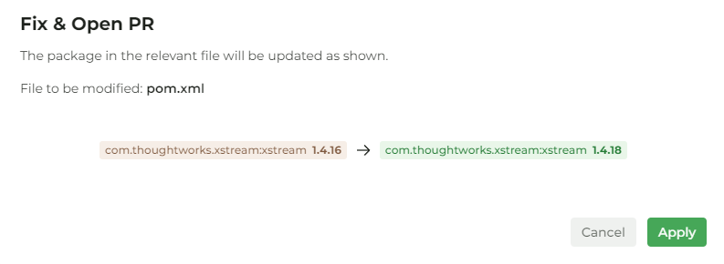

# v2409 Cloud Upgrades, Repo Monitoring, Path Exclusion, and New JS/TS Rulesets

<figure><figcaption></figcaption></figure>


This is our biggest update yet. Over the last six months, we’ve been on a mission to elevate CodeThreat with powerful new features and improvements that redefine how you handle security. From upgraded cloud plans to smarter repo monitoring and expanded rule sets, we’ve packed in everything you need to keep your code secure without missing a beat.\

Dive in and explore what’s next for CodeThreat!


## 🌟 **Latest Update:** v2409

### Cloud Plan Upgrades: Community, Pro, and Business

We now offer new cloud plans that fit different needs:

* **Community Plan**: Basic security features for individuals and small teams.
* **Pro Plan**: Advanced tools and support for growing teams.
* **Business Plan**: Full security management, detailed reporting, and priority support for larger organizations.

Choose the plan that suits your needs and upgrade as your requirements grow.

<figure><figcaption>
everybody loves to see an "upgrade" button &#x3C;3 
</figcaption></figure>

We’ve introduced a new Usage Overview section in CodeThreat, giving users a clear view of their current plan limits and usage metrics:

* **Agent Limit**: Tracks the number of agents utilized against the allowed quota.
* **Member Limit**: Shows the total team members allowed and the current count.
* **Scan Limit**: Displays the weekly scan usage to help manage scanning frequency.
* **Lines of Code**: Monitors the total lines of code scanned under the current plan.
* **Project Limit**: Keeps track of how many projects are being scanned compared to the plan’s maximum.
* **AI Usage Limit**: Shows the monthly AI usage, helping teams optimize AI-driven scans.

This dashboard helps users manage their resources effectively, ensuring they stay within their plan’s limits while maximizing security coverage.

<figure><figcaption></figcaption></figure>

### Repo Monitoring and PR Protection

Keep your code safe, checked with new repo monitoring.

* Import your repository, and we automatically tracks push and pull request events.

<figure><figcaption></figcaption></figure>

* After every push or pull request to your default branch, CodeThreat will start a scan and comment the results

<figure><figcaption></figcaption></figure>

### Path Exclusion

You can now exclude specific paths of your code repositories during scans.

* Focus on critical parts of your code and reduce unnecessary results.
* Get cleaner, more targeted scan results by excluding paths that don’t need checking.

<figure><figcaption></figcaption></figure>

### SCA Fix PR!&#x20;

<figure><figcaption>
dont push dependency updates on friday nights. it is bad idea.
</figcaption></figure>

For opening a fix PR, the target modules files must be one of the following: package.json, pom.xml, requirements.txt, packages.config, and the project type must be one of the following:

* GitHub
* GitLab
* Azure
* Bitbucket

<figure><figcaption>
oh, we use codethreat and codeql for our repositories btw. it is quite good SAST for js/ts.
</figcaption></figure>

### Scan Logs: Real-Time Visibility into Scanning Process

We have introduced a new Scan Logs feature that provides real-time insights into the scanning process. This addition allows users to monitor each step of their scans directly within the platform, ensuring transparency and immediate feedback during security checks.

* **Step-by-Step Log Tracking**: Follow the entire scanning process from initialization to completion, with detailed log entries showing each action taken by the scanner.&#x20;

<figure><figcaption>
to be honest, it is actually for us to fix scanning problems. sssshhh!
</figcaption></figure>

### &#x20;CI/CD Plugins - Async Mode

Added "**Sync Scan**" option field into ci/cd plugins. If you don't want to wait for the pipeline to finish scanning, set it to false

with this setup, users can change or improvize the ci/cd security patterns;

* **Optimized CI/CD Performance:** Async mode decouples security scans from the build process, allowing your pipelines to run without delays. This setup helps maintain the flow of development while ensuring continuous security checks.
* **Non-Blocking Execution:** The async mode ensures that the scanning process does not hold up the pipeline, allowing developers to proceed with other tasks while scans run in the background.

Check it out within our ci/cd plugin repositories such as[ azure devops](https://github.com/CodeThreat/codethreat-azure-plugin)

### New JS/TS Rulesets: 90+ Rules Added&#x20;

<figure><figcaption>
After 90, we stop counting (you can see the real number in the "scanner updates" section in settings)
</figcaption></figure>

* We’ve added 90 new rules for JavaScript and TypeScript. These rules cover popular libraries like Express and AngularJS, enhancing detection and fixing capabilities.&#x20;

Check it out within Vulnerability Hub!


We plan to provide additional rulesets and support for new frameworks in future releases, and we welcome user feedback on these beta analyzers to guide their development and refinement.


### UI/UX Enhancements


We've made significant improvements to the CodeThreat interface to enhance your user experience and make navigating the platform more intuitive.

**Global Scan List Relocation:**

* We’ve removed the global scan list to reduce clutter and improve usability.
* Scans are now organized under each repository section, making it easier to manage and access relevant scans directly within the context of your projects.

**Improved Security Issues List:**

* The security issues list is now nested within the repository overview.
* This change allows you to quickly see all relevant vulnerabilities and issues associated with a specific repository without needing to navigate through multiple menus.

**Enhanced Repository Settings:**

* The repository settings have been updated to be more accessible and user-friendly, providing a smoother experience when managing your repositories.

**Project Creation Experience:**

* We’ve overhauled the project creation process for better alignment and clarity.
* The new interface guides you through available scan options, ensuring you make the most informed decisions when setting up your projects.


### CT Team Updates

Check out [team.codethreat.com](https://team.codethreat.com)


When we first thought about creating our team journal, **team.codethreat.com**, it wasn’t just another task—it was a decision rooted in the desire to bring more structure and cohesion to our remote work environment. Working remotely presents its own set of challenges, and having a central place where everyone can stay connected and informed became a priority for us.

Our goal was to develop a space where our team could find everything they need, from onboarding materials to detailed guides on how we operate. More than just a handbook, it became a tool to help us work smarter together, ensuring that our processes are clear and our values are shared.

#### Why We Created It

Creating team.codethreat.com pushed us to think critically about our workflows, roles, and responsibilities. It forced us to be intentional with our actions and ensure that everyone, from seasoned team members to newcomers, understands how we do things. In doing so, we’ve built a stronger foundation that supports continuous improvement.


### Critical Platform Fixes&#x20;

* Fixed problems where members could not be invited in certain cases.
* Resolved rescan problems when the current Personal Access Token (PAT) had expired.
* Improved fail-safe mechanisms for on-premises AI usage, ensuring more reliable performance.
