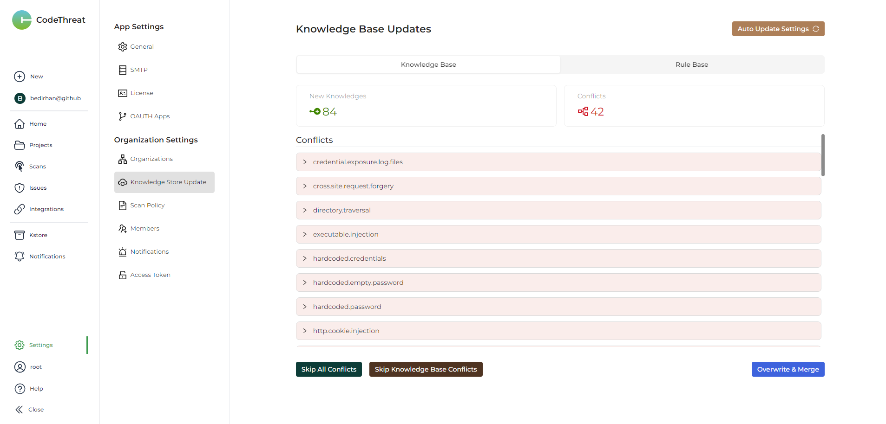

# Our story

CodeThreat began as a passion project focused on meeting industry standards and delivering real business value. Our journey started with a small, self-funded team aiming to transform application security. We officially launched our team and products in early 2023.

Initially, we concentrated on evaluating existing AppSec programs to understand the value they provided to users. This led to the creation of projects like [FlowBlot.net](https://github.com/CodeThreat/FlowBlot.NET), which laid the foundation for our future efforts. We started as a research team, emphasizing benchmarks and critical thinking, which has become a core part of our identity.

As a team that began with a research focus, we developed unique approaches to program analysis and AppSec programs. Our initial efforts in dataflow and taint analysis outputs marked the beginning of our scanner development. We spent a significant amount of time refining our tools before transitioning into a product phase. The early stages of our program analysis framework, now known as ShiftQL, were rigorously tested in various early test beds over extended periods.

> Over time, we have evolved into a team that is dedicated to understanding how industry changes affect end-users. We continually measure and analyze these impacts, aiming to solve the core problems faced by our target audience.

#### We prefer a startup approach with constant iterations and data-driven decisions, but

> In extreme, uncertain, and chaotic moments, we embrace the disorder, diving into it and leveraging the uncertainty to create innovative and risky implementations of new technologies that have never been attempted before.

**Evaluating Challenges and Recognizing Achievements**

> We pause to evaluate our successes and failures. We recognize that mistakes are part of our journey, and we find value in learning from them. Our approach is to analyze these instances from the ground up, focusing on finding solutions rather than making excuses. This reflective process ensures continuous improvement and innovation in our workflows and solutions.

The purpose of this handbook is to document and maintain the essence of our practices and solutions. Whether our team consists of five or ten people, we believe the solutions we implement go beyond products. They represent significant team efforts. This handbook ensures that both new and current team members can understand and contribute to our transparent workflows, maintain our systems, and most importantly, continue to provide value to our users efficiently.

<figure><figcaption>
message counts of our communication platform.
</figcaption></figure>
