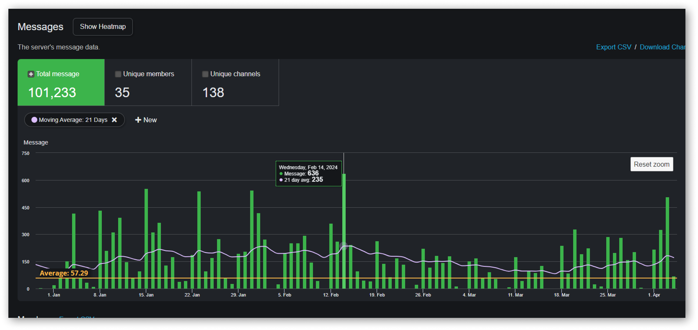

# Issue List

<figure><figcaption></figcaption></figure>

* **Default Grouping:** By default, vulnerabilities are grouped by programming language, followed by the vulnerability name. For instance: **`Python -> SQL Injection`**.
* **Custom Grouping:** Users also have the option to group vulnerabilities by programming language followed by the file in which the vulnerability was detected, for example: **`Python -> main.py`**.

<figure><figcaption></figcaption></figure>

**Filtering Options:**

At the top of the page, users can filter the vulnerabilities based on certain criteria.

By using the filter, users can choose to view vulnerabilities specific to certain programming languages. This feature is beneficial when users are more concerned about vulnerabilities in a particular set of languages.

**Grouping Selection:**

Users have the flexibility to modify how the vulnerabilities are grouped.

1. Navigate to the list at the top of the page.
2. Choose between "Severities" or "Platform" as the primary grouping method. This will reorganize the displayed vulnerabilities accordingly.

**Notes:**

* The Issues Page is designed to offer users an intuitive and organized overview of all detected vulnerabilities.
* Using the filtering and grouping functionalities can help users prioritize and address the most critical issues first, especially in cases where there are numerous findings.
* It's advised to periodically review the Issues Page after scans to understand the security posture of the codebase and take necessary remediation actions.
